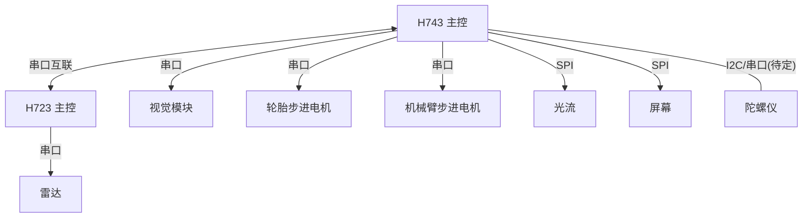

# 工程架构

```mermaid
flowchart TD
    A["H743 主控"]
    B["H723 主控"]
    A <-->|"串口互联"| B
    A -->|"串口"| C["视觉模块"]
    A -->|"串口"| D["轮胎步进电机"]
    A -->|"串口"| E["机械臂步进电机"]
    A -->|"SPI"| G["光流"]
    A -->|"SPI"| H["屏幕"]
    A ---|"I2C/串口(待定)"| I["陀螺仪"]
    B -->|"串口"| F["雷达"]
```

## 待补充

- [ ] 双主控互联所用串口及引脚
- [ ] 各外设所接串口及引脚（可对照 h723/h743 引脚分配表）